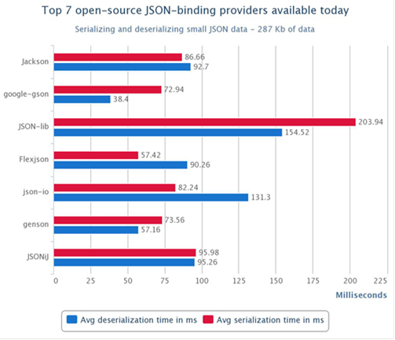
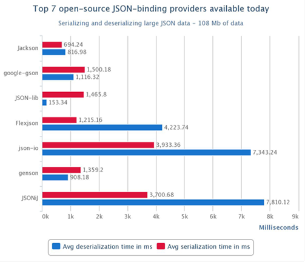

JSON library 비교
================

## 결론
Jackson 쓰자

## 근거

>
>- 테스트 방식
>- 50회 반복 및 10회 워밍업 반복
>  
>
>
>위의 그래프는 JSON data 287 Kb 자료의 직렬화 역직렬화의 걸리는 시간을 나타냈다.
>
>- 직렬화 최단 라이브러리 : Flexjson
>- 역 직렬화 최단 라이브러리 : google-gson
>
>직렬화 와 역 직렬화를 동시에 할 경우 ( google-gson )이 111.34 ms 로 가장 빠른 것으로 나타났다.
>
>
>
>
>위의 그래프는 JSON data 108 Mb 자료의 직렬화 역직렬화의 걸리는 시간을 나타냈다.
>
>
>- 직렬화 최단 라이브러리 : Jackson
>- 역 직렬화 최단 라이브러리 : JSON-lib
>
>직렬화 와 역 직렬화를 동시에 할 경우 ( Jackson )이 1511.22 ms 로 가장 빠른 것으로 나타났다.
>
>
>따라서 대용량 데이터 처리에는 Jackson을 저용량 데이터 처리에는 google-gson을 처리해야 한다는 것을 보여주지만
>
>사용자와 환경에 따라서 잘 선택하는 것이 좋아보인다.

하지만, 데이터가 적을 때는 느려도 티가 나지 않는다. 그러므로 jackson을 사용하자.

## 참고
[JSON 어떤 라이브러리를 사용해야 할까?](https://dundun-dev.tistory.com/2)

